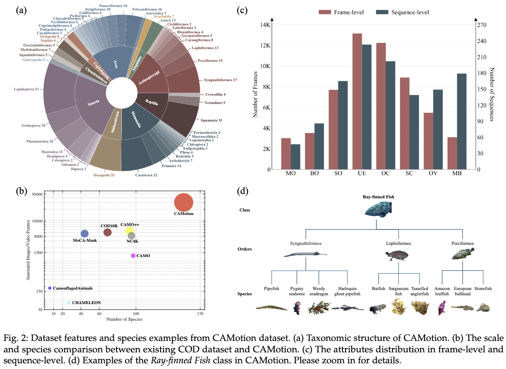
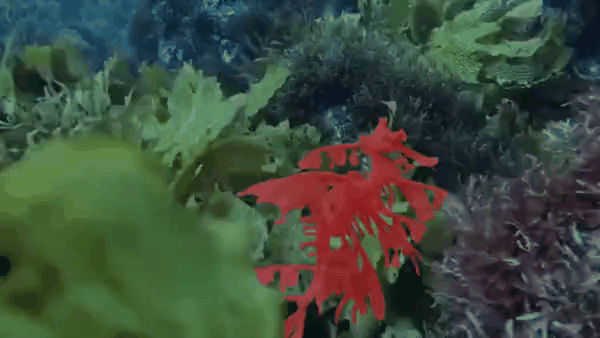
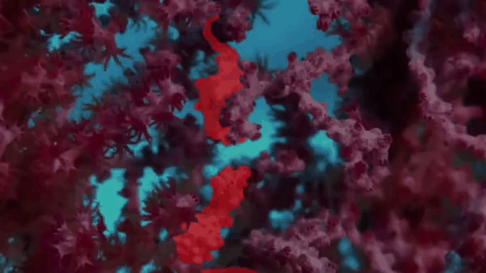
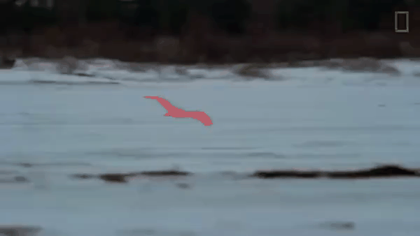

# CAMotion: A High-Quality Dataset for Camouflaged Moving Object Detection in the Wild

**Authors:** Siyuan Yao, Hao Sun, Ruiqi Yu, Xiwei Jiang, Wenqi Ren, and Xiaochun Cao.

[Project Page](https://www.camotion.focuslab.net.cn) [Preprint](https://github.com/Garyson1204/CAMotion/blob/77abc8095b48aae8e75412ab97b98872682f2feb/assets/CAMotion%20A%20High-Quality%20Dataset%20for%20Camouflaged%20Motion%20Object%20Detection%20in%20the%20Wild.pdf)

## Overview

Discovering camouflaged objects is a challenging task in computer vision due to the high similarity between camouflaged objects and their surroundings. While the problem of camouflaged object detection over sequential video frames has received increasing attention, the scale and diversity of existing video camouflaged object detection (VCOD) datasets are greatly limited, which hinders the deeper analysis and broader evaluation of recent deep learning-based algorithms with data-hungry training strategy. To break this bottleneck, in this paper, we construct CAMotion, a high-quality benchmark covers a wide range of species for camouflaged moving object detection in the wild. CAMotion comprises various sequences with multiple challenging attributes such as uncertain edge, occlusion, motion blur, and shape complexity, etc. The sequence annotation details and statistical distribution are presented from various perspectives, allowing CAMotion to provide in-depth analyses on the camouflaged object's motion characteristics in different challenging scenarios. Additionally, we conduct a comprehensive evaluation of existing SOTA models on CAMotion, and discuss the major challenges in VCOD tasks. The benchmark is available at [https://www.camotion.focuslab.net.cn](https://www.camotion.focuslab.net.cn), we hope that our CAMotion can lead to further advancements in the research community.

## Demo

<table>
  <tr>
    <td align="center"> Batfish</td>
    <td align="center"> Clownfish</td>
    <td align="center"> Common octopus</td>
    <td align="center"> Leaf-tailed geckos</td>
  </tr>
  <tr>
    <td align="center"> Leafy seadragon</td>
    <td align="center"> Mockingbird</td>
    <td align="center"> Moss mimic stick insect</td>
    <td align="center"> Peppered moth</td>
  </tr>
  <tr>
    <td align="center"> Pygmy seahorse</td>
    <td align="center"> Snow leopard</td>
    <td align="center"> Snowy owl</td>
    <td align="center"> Stoat</td>
  </tr>
</table>

## Dataset

The training and testing datasets can be found at [Google Drive](https://drive.google.com/file/d/1YzNdlDhsfgXTZ-Ya1w9wn3SjTXwU2xFs/view?usp=drive_link) and Baidu Netdisk.

## Depth & Optical Flow

The depth map generated by [Depth Anything V2](https://github.com/DepthAnything/Depth-Anything-V2) and optical flow generated by [GMFlow](https://github.com/autonomousvision/unimatch) can be found at [Google Drive](https://drive.google.com/file/d/1xEx1BMHFJaOGl_SJ8r5vRsNTfbRURRjs/view?usp=sharing).
